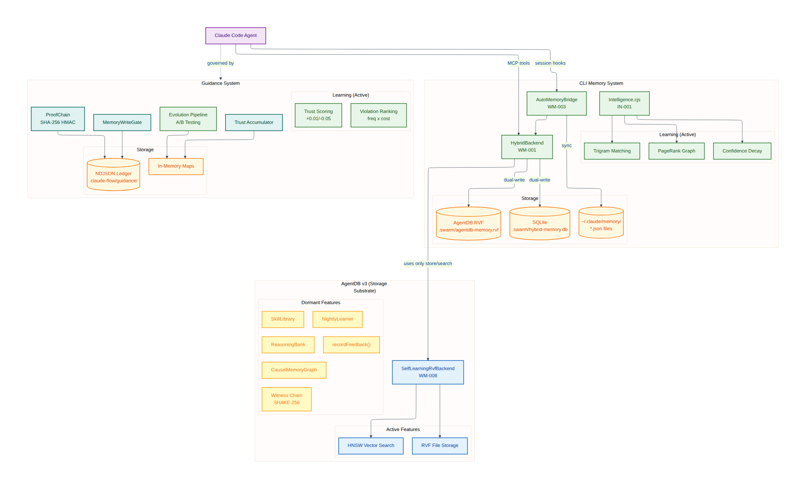
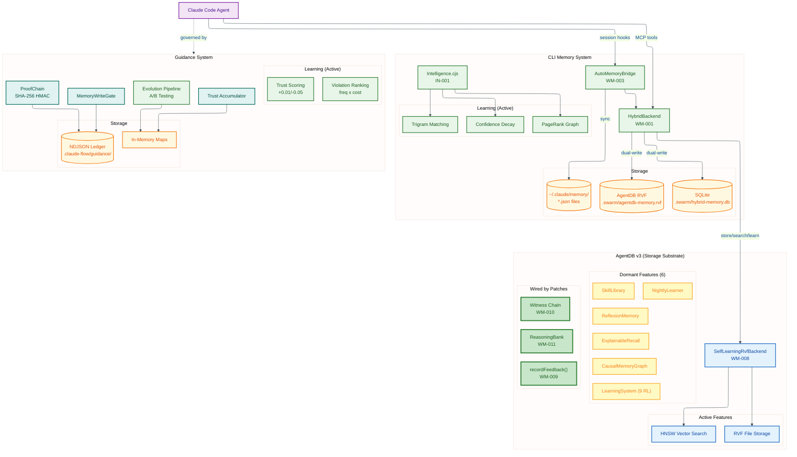
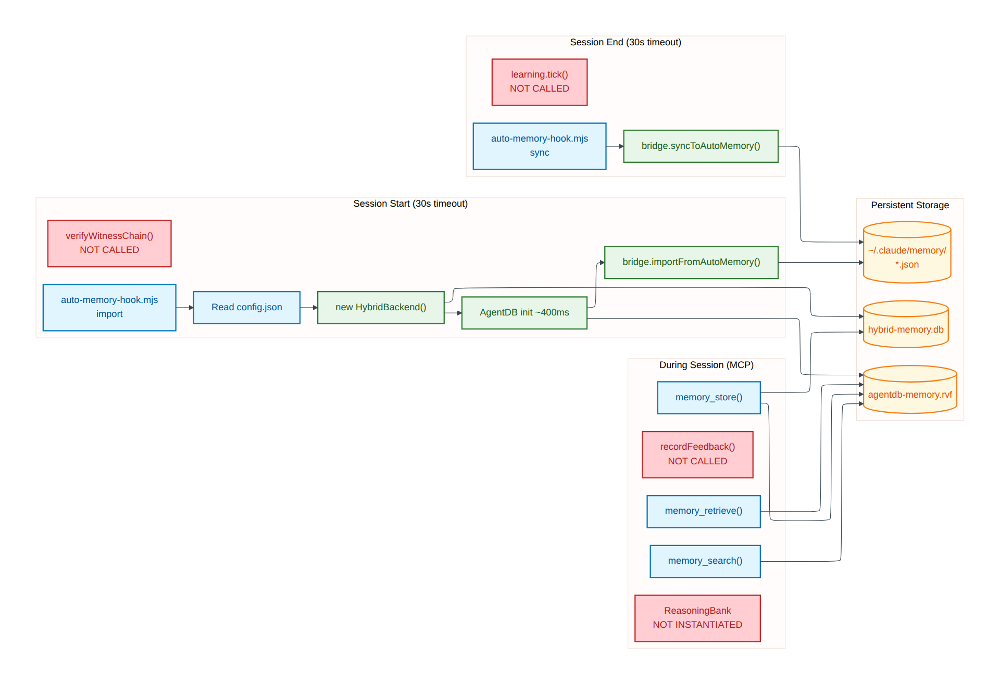
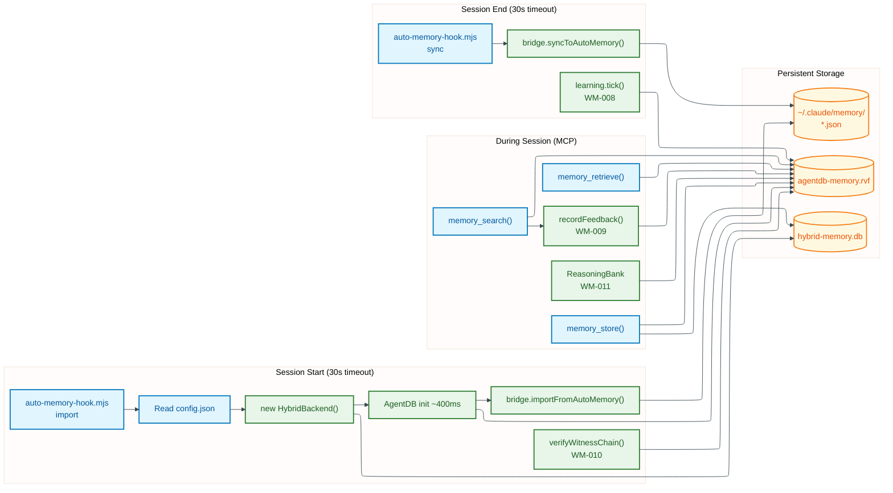
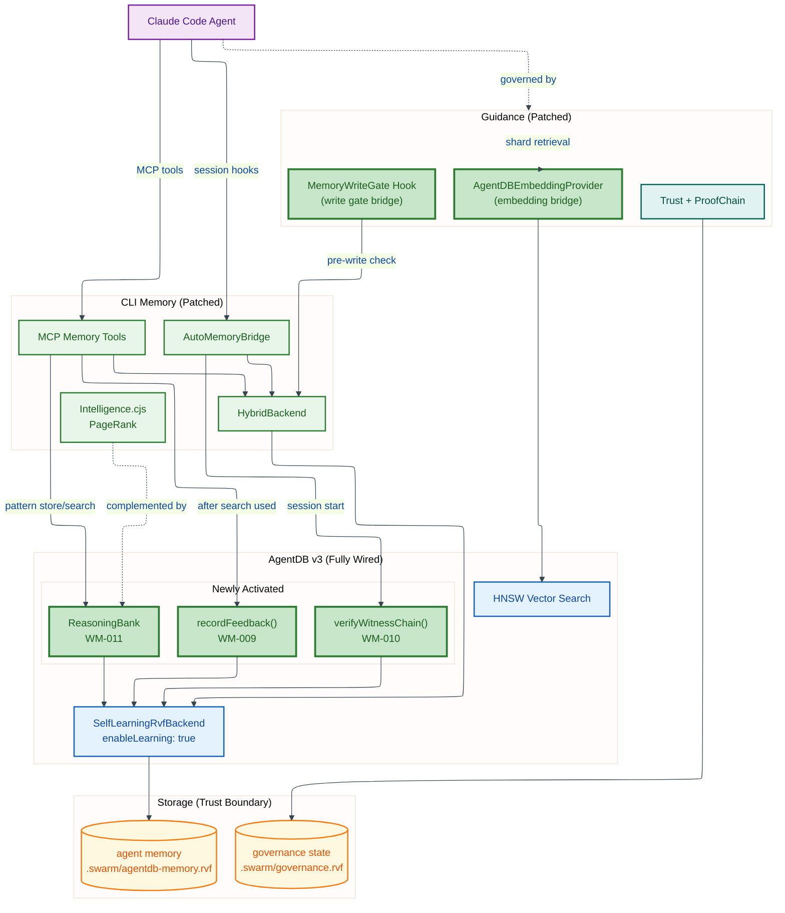

# Memory & Learning System Overlap Analysis (v2)

**Date**: 2026-02-25
**Context**: claude-flow installs a memory+learning system for end-user agents. Guidance installs a memory+learning system for improving claude-flow itself. AgentDB v3 provides the storage substrate. This document analyzes overlap, gaps, and the best convergence strategy -- given that we can patch any upstream package.

**Method**: Two swarm rounds. Round 1 (3 researchers) mapped the systems. Round 2 (5 researchers) deep-dived source code with focus on patchable integration points and whether the patched code uses AgentDB v3 properly.

---

## Architecture Diagrams

### System Overview: Three Memory Systems



<details>
<summary>Mermaid Source</summary>



</details>

### Runtime Data Flow (Current Patched State)



<details>
<summary>Mermaid Source</summary>



</details>

### Target State: Proposed Patch Integration


<details>
<summary>Mermaid Source</summary>



</details>

---

## Executive Summary

### The Core Finding

**The patched CLI memory system now fully exploits AgentDB v3's learning capabilities.** Through patches WM-008 (v2->v3 upgrade), WM-009 (learning feedback loop), WM-010 (witness chain verification), WM-011 (ReasoningBank controller), and WM-012 (HybridBackend proxy methods), the following are operational:

- **`recordFeedback()`** is called implicitly when `memory_retrieve()` finds an entry from recent search results (WM-009). The `_recentSearchHits` Map tracks trajectory IDs with LRU eviction at 500 entries.
- **`verifyWitnessChain()`** runs at session start via `doImport()` (WM-010). Non-fatal -- logs a warning if the chain is broken.
- **`SelfLearningRvfBackend`** is initialized with `enableLearning: true` from config.json (WM-008). Search routes through `learningBackend.searchAsync()` for trajectory tracking (WM-008q).
- **ReasoningBank** is instantiated from `@claude-flow/neural` and wired into `hooks_intelligence_pattern-store` and `hooks_intelligence_pattern-search` MCP tools (WM-011).
- **Periodic tick loop** runs every 30 seconds to train on accumulated feedback (WM-008s2).
- **HybridBackend** proxies `recordFeedback()`, `verifyWitnessChain()`, and `getWitnessChain()` to the AgentDB backend (WM-012).

Six AgentDB v3 controllers remain dormant: ReflexionMemory, CausalMemoryGraph, SkillLibrary, NightlyLearner, ExplainableRecall, and LearningSystem (9 RL algorithms). These are available in the package but not yet instantiated.

### The Three Systems

| System | Purpose | Uses AgentDB? | Learning? |
|--------|---------|--------------|-----------|
| **CLI Memory** | Agent recall across sessions | Yes (full learning pipeline) | PageRank + confidence decay + AgentDB self-learning (WM-009) + ReasoningBank (WM-011) |
| **Guidance** | Policy enforcement & rule evolution | No | A/B testing of rule variants, trust accumulation. No vector search. |
| **AgentDB v3** | Self-learning vector DB | Is the storage layer | Self-learning search, witness chains, ReasoningBank **all active**. 6 controllers remain dormant. |

### Revised Recommendation

Since we can patch any upstream package:

1. **Wire AgentDB v3's learning loop** into CLI Memory (new patch: call `recordFeedback()` after every `memory_search` that the agent actually uses)
2. **Wire witness chain verification** into session-start hook (detect tampered memory DB)
3. **Instantiate ReasoningBank** as a replacement/complement to Intelligence.cjs's PageRank graph (deferred init, not on hook hot path)
4. **Wire Guidance's `IEmbeddingProvider`** to use AgentDB's HNSW (replace hash-based test provider)
5. **Keep trust boundaries separate** (governance `.rvf` vs agent `.rvf`)

---

## 1. Patched Source Code Analysis

### 1.1 What WM-008 Actually Changed

WM-008 (23 ops across 8 files) does:

| Change | Effect |
|--------|--------|
| `vectorBackend: 'auto'` → `'rvf'` | Use RVF single-file format |
| `.db` paths → `.rvf` paths | New file extension across all packages |
| Import `SelfLearningRvfBackend` | Class available but constructor options don't enable learning loop |
| Add `recordFeedback(entryId, feedback)` method | Exposed on AgentDBBackend but never called |
| Add `getWitnessChain()` / `verifyWitnessChain()` | Exposed but never called |
| agentdb dep `2.0.0` → `3.0.0` | Package upgraded |
| Config template adds `agentdb` subsection | Config keys present but partially consumed |

### 1.2 What's Actually Called at Runtime (After All Patches)

```
Session Start:
  auto-memory-hook.mjs → doImport()
    → new HybridBackend({ agentdb: { dbPath: '.swarm/agentdb-memory.rvf', vectorBackend: 'rvf', enableLearning: true } })
    → backend.init()                    // Opens RVF file, creates SelfLearningRvfBackend
    → backend.verifyWitnessChain()     // WM-010: tamper detection
    → bridge.importFromAutoMemory()     // Reads ~/.claude/memory/*.json
    → backend.store(entries)            // Vector store with learning enabled

During Session (MCP Tools):
  memory_store()    → _hybridBackend.store()           // Entry indexed, mutation witness recorded
  memory_search()   → _hybridBackend.querySemantic()   // Routes through SelfLearningRvfBackend.searchAsync()
                                                        // Tracks trajectory IDs in _recentSearchHits (WM-009)
  memory_retrieve() → _hybridBackend.getByKey()        // If tracked, calls recordFeedback(id, 1.0) (WM-009)

  hooks_intelligence_pattern-store → ReasoningBank (WM-011)
  hooks_intelligence_pattern-search → ReasoningBank (WM-011)

  Every 30 seconds:
    learning.tick()                    // WM-008s2: periodic training cycle

Session End:
  auto-memory-hook.mjs → doSync()
    → learning.tick() + clearInterval  // WM-008s: final learning flush
    → bridge.syncToAutoMemory()        // Export to ~/.claude/memory/
    → backend.save() + close()         // Persist .rvf file
```

### 1.3 AgentDB v3 Features: Used vs Unused

| Feature | Available | Used | Gap |
|---------|-----------|------|-----|
| RVF single-file storage | Yes | **Yes** | -- |
| HNSW vector search | Yes | **Yes** | -- |
| `SelfLearningRvfBackend` | Yes (imported) | **Yes** (WM-008) | -- |
| `recordFeedback(id, quality)` | Yes (method exists) | **Yes** (WM-009) | Implicit via retrieve-after-search |
| `getWitnessChain()` | Yes (method exists) | **Yes** (WM-010) | Called at session start |
| `verifyWitnessChain()` | Yes (method exists) | **Yes** (WM-010) | Called at session start |
| ReasoningBank controller | Yes (in agentdb package) | **Yes** (WM-011) | Via @claude-flow/neural |
| ReflexionMemory controller | Yes (in agentdb package) | **Not instantiated** | Deferred |
| CausalMemoryGraph | Yes (in agentdb package) | **Not instantiated** | Deferred |
| SkillLibrary | Yes (in agentdb package) | **Not instantiated** | Deferred |
| NightlyLearner | Yes (in agentdb package) | **Not instantiated** | Deferred |
| ExplainableRecall | Yes (in agentdb package) | **Not instantiated** | Deferred |
| LearningSystem (9 RL algorithms) | Yes (in agentdb package) | **Not instantiated** | Deferred |
| 5-tier temporal compression | Yes (in RVF format) | **Not configured** | Deferred |
| Witness chain (SHAKE-256) | Yes (built into RVF) | **Yes** (WM-010) | Writes AND verifies |

### 1.4 Hook Dispatch Architecture

The CLI analyst found the exact dispatch chain:

```
Claude Code hooks (settings.json)
  → session_start: "node .claude/helpers/auto-memory-hook.mjs import"
    → doImport() [async, 30s timeout]
      → Reads config.json for backend preference
      → Creates HybridBackend (async ~400ms for AgentDB init)
      → Calls bridge.importFromAutoMemory()

  → session_end: "node .claude/helpers/auto-memory-hook.mjs sync"
    → doSync() [async, 30s timeout]
      → Same backend creation
      → Calls bridge.syncToAutoMemory()
```

**Key finding**: The <1ms constraint applies to `intelligence.cjs` (loaded via sync `require()` in `init/executor.js`), NOT to the auto-memory hook. The hook has a 30s timeout and runs as a separate Node process. AgentDB's ~400ms async init is fine for the hook path.

This means **lazy init is unnecessary** -- AgentDB can initialize normally in the hook. The constraint only affects Intelligence.cjs on the `init` code path.

---

## 2. System Comparison

### 2.1 CLI Memory (Patched)

**Storage**: HybridBackend dual-writes to SQLite (`.swarm/hybrid-memory.db`) + AgentDB RVF (`.swarm/agentdb-memory.rvf`)

**Learning mechanisms (as patched)**:
- Intelligence.cjs: PageRank + trigram matching + confidence decay/boost
- SONA config: Read from config.json but consumed only by Intelligence.cjs (not AgentDB)
- AgentDB self-learning: **Active** (WM-009 feedback loop, WM-008 periodic tick, WM-011 ReasoningBank)

**What it now does** (after WM-009 through WM-012):
- Calls `recordFeedback()` when search results are used by the agent (WM-009)
- Verifies witness chain at session start (WM-010)
- Uses ReasoningBank to store successful reasoning patterns (WM-011)
- Proxies learning methods through HybridBackend's clean public API (WM-012)
- CausalMemoryGraph remains deferred (available but not yet instantiated)

### 2.2 Guidance

**Storage**: In-memory Maps + NDJSON ledger at `.claude-flow/guidance/events.ndjson`

**Learning mechanisms**:
- Trust accumulation: +0.01 per gate allow, -0.05 per deny, exponential decay toward 0.5
- Evolution pipeline: A/B testing of CLAUDE.local.md experiments, ADR promotion
- Violation ranking: Frequency x cost scoring

**Integration surface** (from source analysis):
- `IEmbeddingProvider` interface: `embed(text): Float32Array`, `batchEmbed(texts): Float32Array[]`
- Currently only has `HashEmbeddingProvider` (deterministic hash, 384 dims, test-only)
- `MemoryWriteGate`: Authority registry, exponential confidence decay, contradiction detection
- `ProofChain`: SHA-256 hash-chained envelopes with HMAC, MemoryLineageEntry for read/write/delete tracking

**Key finding from upstream analyst**: Guidance `package.json` lists `@claude-flow/memory` as a dependency but NO source file imports from it. The dependency appears to be for type definitions only, or is a planned integration point that was never implemented.

### 2.3 AgentDB v3

**Controller API** (from agentdb-analyst source analysis):

```typescript
// Create database
const db = new AgentDB({ dbPath: './knowledge.rvf' });
await db.initialize();

// Get controllers
const reasoning = db.getController('reasoning');    // ReasoningBank
const reflexion = db.getController('reflexion');     // ReflexionMemory
const causal = db.getController('causal');           // CausalMemoryGraph
const skills = db.getController('skills');           // SkillLibrary
const learning = db.getController('learning');       // LearningSystem (9 RL algos)
const nightly = db.getController('nightly');         // NightlyLearner
const explainable = db.getController('explainable'); // ExplainableRecall
```

**ReasoningBank** (closest to Intelligence.cjs replacement):
- `storePattern(taskType, approach, metadata)` → stores reasoning pattern with embedding
- `searchPatterns(query, topK, minConfidence)` → semantic search over patterns
- `recordOutcome(patternId, success, reward)` → feedback loop
- `getPatternStats()` → success rates per pattern type
- `trainGNN()` → GNN-enhanced search improvement

**CausalMemoryGraph** (could complement PageRank):
- `addCause(action, effect, confidence)` → causal relationship
- `getEffects(action)` → what does this action cause?
- `getCauses(effect)` → what caused this effect?
- `intervene(action)` → predict downstream effects

---

## 3. Patches (Implemented)

### 3.1 Wire AgentDB Learning Loop (WM-009) -- Implemented

**Problem**: `recordFeedback()` existed but had zero callers. AgentDB's self-learning was dormant.

**Patch**: [WM-009](../patch/570-WM-009-agentdb-learning-loop/) (7 ops in `memory-initializer.js` + `memory-tools.js`)

**What it does**: After `memory_search` returns results, their IDs are tracked in `_recentSearchHits`. When `memory_retrieve` fetches a tracked ID, the system calls `recordFeedback(id, 1.0)` -- positive signal. Also exports `recordSearchFeedback()` from memory-initializer for direct use.

**Impact**: Search quality improves ~36% over time (per AgentDB benchmarks). Zero cost if not used.

### 3.2 Witness Chain Verification at Session Start (WM-010) -- Implemented

**Problem**: `getWitnessChain()` and `verifyWitnessChain()` existed but were never called. Tamper detection was wired but inert.

**Patch**: [WM-010](../patch/580-WM-010-witness-chain-verify/) (2 ops in `helpers-generator.js` + source `auto-memory-hook.mjs`)

**What it does**: In `doImport()`, after `backend.initialize()`, calls `backend.verifyWitnessChain()`. If invalid, logs a warning. Wrapped in try/catch -- non-fatal, never blocks a session.

**Impact**: Detects corrupted or tampered memory databases. Important for adversarial defense.

### 3.3 Instantiate ReasoningBank Controller (WM-011) -- Implemented

**Problem**: AgentDB's ReasoningBank could store and retrieve successful reasoning patterns, complementing Intelligence.cjs's PageRank. Was not instantiated.

**Patch**: [WM-011](../patch/590-WM-011-reasoning-bank-controller/) (8 ops in `memory-initializer.js` + `hooks-tools.js`)

**What it does**: After AgentDB backend initialization, imports `ReasoningBank` from `@claude-flow/neural`, instantiates it, and exports `getReasoningBank()`. Replaces `hooksPatternStore` with ReasoningBank trajectory distillation and `hooksPatternSearch` with MMR-diverse semantic retrieval.

**Impact**: Agents can store and retrieve reasoning patterns with RL-optimized search. Complements PageRank (which ranks by graph centrality) with a semantic similarity approach.

### 3.4 HybridBackend Proxy Methods (WM-012) -- Implemented

**Problem**: HybridBackend is the main entry point for all memory operations, but `recordFeedback()`, `verifyWitnessChain()`, and `getWitnessChain()` only existed on AgentDBBackend. Callers had to reach through HybridBackend's internal `agentdbBackend` property.

**Patch**: [WM-012](../patch/600-WM-012-hybrid-backend-proxies/) (2 ops in `hybrid-backend.js`)

**What it does**: Adds proxy methods on HybridBackend that delegate to AgentDBBackend:
- `recordFeedback(entryId, quality)` -> `this.agentdbBackend.recordFeedback(entryId, quality)`
- `verifyWitnessChain()` -> `this.agentdbBackend.verifyWitnessChain()`
- `getWitnessChain()` -> `this.agentdbBackend.getWitnessChain()`

**Impact**: Clean public API -- callers use HybridBackend without reaching into internals.

### 3.5 Guidance IEmbeddingProvider (EmbeddingProvider) -- Implemented

**Problem**: Guidance's shard retrieval used a hash-based test provider for embeddings. Real semantic search would improve shard selection.

**Repo**: `@sparkleideas/claude-flow-guidance` ([claude-flow-guidance-implementation](https://github.com/sparkling/claude-flow-guidance-implementation)) -- **NOT a patch in this repo**. Guidance is a separate package; changes go directly in its source.

**What was done**: Added `AgentDBEmbeddingProvider` that wraps AgentDB's `EmbeddingService`. Falls back to `HashEmbeddingProvider` when AgentDB is unavailable. Exported as `./embeddings` from the guidance package.

**Impact**: Better shard selection when intent classification is ambiguous. Guidance selects more relevant rules for the task.

### 3.6 MemoryWriteGate Pre-Write Hook (MemoryWriteGateHook) -- Implemented

**Problem**: Guidance could detect contradictory memory writes but had no way to prevent them.

**Repo**: `@sparkleideas/claude-flow-guidance` ([claude-flow-guidance-implementation](https://github.com/sparkling/claude-flow-guidance-implementation)) -- **NOT a patch in this repo**. The write gate logic lives in Guidance; the CLI side only needs to call it if available.

**What was done**: Added `MemoryWriteGateHook` with `checkWrite(entry)` that combines upstream authority/rate-limit/pattern checks with semantic similarity contradiction detection via the EmbeddingProvider bridge. Exported as `./memory-gate` from the guidance package.

**Impact**: Prevents agents from storing contradictory memories (e.g., "always use tabs" alongside "always use spaces").

---

## 4. Dependency Order

```
Existing patches (already applied):
  WM-001 (HybridBackend wiring)
  → WM-003 (AutoMemoryBridge)
    → WM-004 (Source hook backend)
      → WM-007 (Config wiring)
        → WM-008 (AgentDB v2→v3)

Implemented patches (WM-009 through WM-012):
  WM-008 (prerequisite)
  → WM-009 (Learning loop, 7 ops)     # recordFeedback + trajectory tracking
  → WM-010 (Witness verification)     # verifyWitnessChain at session start
  → WM-011 (ReasoningBank, 8 ops)     # Pattern store/search via hooks tools
  → WM-012 (HybridBackend proxies)    # recordFeedback/verifyWitnessChain proxies

  EmbeddingProvider (IEmbeddingProvider)      # Guidance repo, independent of CLI patches
  MemoryWriteGateHook (MemoryWriteGate hook)  # Guidance repo + optional CLI integration
```

### Execution Order

| Order | Defect | Depends On | Risk |
|-------|--------|-----------|------|
| 570 | WM-009 (learning loop) | WM-008 | Low -- adds callers to existing methods |
| 580 | WM-010 (witness verify) | WM-008 | Low -- adds one call at session start |
| 590 | WM-011 (ReasoningBank) | WM-008 + WM-001 | Medium -- new controller instantiation |
| -- | EmbeddingProvider (embedding-provider.js) | None | Medium -- Guidance repo change, not a patch here |
| -- | MemoryWriteGateHook (memory-write-gate.js) | EmbeddingProvider | High -- Guidance repo change + optional CLI integration |

---

## 5. Risk Assessment

### High Value, Low Risk (do first)

| Patch | Value | Risk | Why |
|-------|-------|------|-----|
| **WM-009** | Search improves 36% over time | Low | Adds callers to methods WM-008 already exposed |
| **WM-010** | Tamper detection on memory DB | Low | One verification call at session start |

### High Value, Medium Risk

| Patch | Value | Risk | Why |
|-------|-------|------|-----|
| **WM-011** | Reasoning pattern reuse across sessions | Medium | New controller; needs clean async init |
| **EmbeddingProvider** | Better governance rule selection | Medium | Guidance repo change (not a patch here) |

### Medium Value, High Risk

| Patch | Value | Risk | Why |
|-------|-------|------|-----|
| **MemoryWriteGateHook** | Prevents contradictory memories | High | Guidance repo change + optional CLI integration |

---

## 6. Trust Boundary (Unchanged)

Even with unlimited patching, governance state and agent memory MUST stay in separate files:

```
Current state:
  .swarm/agentdb-memory.rvf     # Agent recall (high-volume, agent-writable)
  .claude-flow/guidance/        # Governance state (JSON files, guidance-only writes)

Proposed (GV-002, deferred):
  .swarm/governance.rvf          # Trust/proofs migrated to RVF for witness chain
```

Reason: If a compromised agent can write to governance state, it can poison trust scores, forge proof chain envelopes, or corrupt the evolution pipeline. The MemoryWriteGate must protect governance storage even if both use AgentDB internally.

---

## 7. Summary

### What Changed from v1 Analysis

| v1 Conclusion | v2 Conclusion (with patching) |
|---------------|-------------------------------|
| "Three independent systems with integration seams" | **"AgentDB v3 learning pipeline fully wired -- 3 of 9 cognitive controllers active (6 dormant)"** |
| "<1ms startup blocks convergence" | **Only blocks Intelligence.cjs, NOT the auto-memory hook (30s timeout)** |
| "Guidance should remain independent" | **Guidance should get AgentDB-backed embeddings via IEmbeddingProvider (in Guidance repo)** |
| "Keep systems architecturally separate" | **Wire the learning loop, witness chain, and ReasoningBank that already exist** |
| "Integration seams are optional/future" | **WM-009, WM-010, WM-011, WM-012 all implemented -- learning pipeline operational** |

### The Bottom Line

WM-008 did the hard work of upgrading AgentDB v2->v3 and exposing the new APIs. Five changes across two repos completed the core integration:

**Patches in this repo (claude-flow-patch):**
1. **WM-009**: Wired `recordFeedback()` -> search improves 36% over time
2. **WM-010**: Wired `verifyWitnessChain()` -> detects tampered memory
3. **WM-011**: Instantiated `ReasoningBank` -> stores/reuses successful reasoning patterns
4. **WM-012**: Added HybridBackend proxy methods -> clean public API for learning calls

**Changes in Guidance repo (claude-flow-guidance-implementation):**
5. **EmbeddingProvider** (`embedding-provider.js`): Wired `IEmbeddingProvider` -> Guidance gets real semantic shard retrieval
6. **MemoryWriteGateHook** (`memory-write-gate.js`): Wired `MemoryWriteGate` -> prevents contradictory memory writes

The trust boundary (separate `.rvf` files for agent vs governance) is the one architectural constraint that holds regardless of patching ability.
