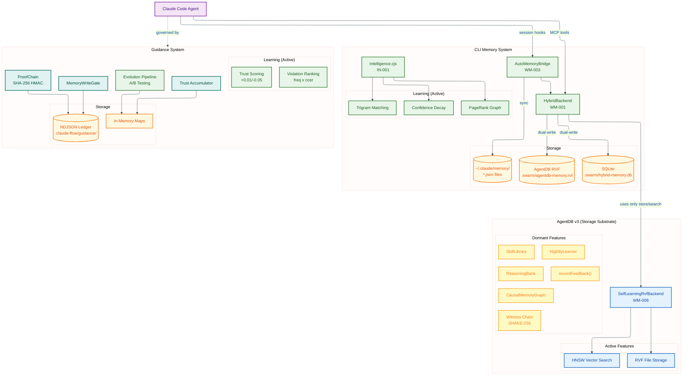
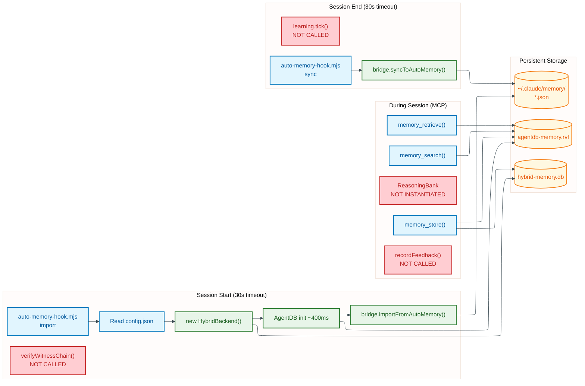
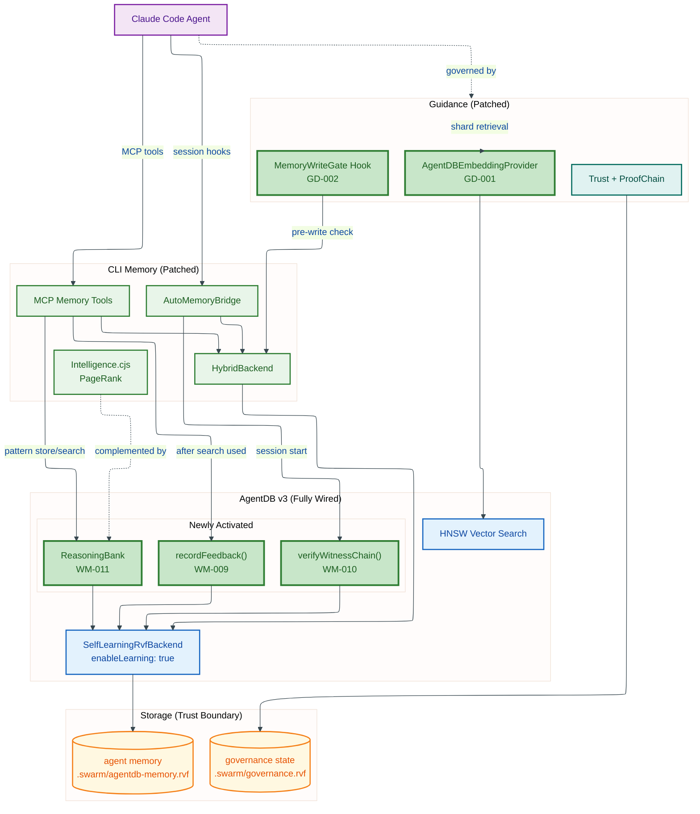

# Memory & Learning System Overlap Analysis (v2)

**Date**: 2026-02-23
**Context**: claude-flow installs a memory+learning system for end-user agents. Guidance installs a memory+learning system for improving claude-flow itself. AgentDB v3 provides the storage substrate. This document analyzes overlap, gaps, and the best convergence strategy -- given that we can patch any upstream package.

**Method**: Two swarm rounds. Round 1 (3 researchers) mapped the systems. Round 2 (5 researchers) deep-dived source code with focus on patchable integration points and whether the patched code uses AgentDB v3 properly.

---

## Architecture Diagrams

### System Overview: Three Memory Systems


<details>
<summary>Mermaid Source</summary>



</details>

### Runtime Data Flow (Current Patched State)


<details>
<summary>Mermaid Source</summary>



</details>

### Target State: Proposed Patch Integration


<details>
<summary>Mermaid Source</summary>



</details>

---

## Executive Summary

### The Core Finding

**The patched CLI memory system uses AgentDB v3 as a dumb vector store.** It imports `SelfLearningRvfBackend` and exposes `recordFeedback()` / `getWitnessChain()` / `verifyWitnessChain()` methods, but:

- **Zero callers** of `recordFeedback()` exist in the patched code. Learning is wired but never triggered.
- **Zero callers** of `getWitnessChain()` or `verifyWitnessChain()`. Tamper detection is exposed but never used.
- **None of AgentDB v3's 6 cognitive patterns** (Reflexion, ReasoningBank, CausalMemoryGraph, SkillLibrary, NightlyLearner, ExplainableRecall) are instantiated or used anywhere.
- AgentDB is used exclusively for: `store()`, `search()` (via `querySemantic()`), `delete()`, `getByKey()`.

This means WM-008 upgraded the *dependency* from v2 to v3 and exposed the new APIs, but the actual *behavior* is still v2-level: basic HNSW vector storage with no learning, no witness verification, no cognitive patterns.

### The Three Systems

| System | Purpose | Uses AgentDB? | Learning? |
|--------|---------|--------------|-----------|
| **CLI Memory** | Agent recall across sessions | Yes (as dumb vector store) | PageRank (Intelligence.cjs) + confidence decay. No RL, no self-learning. |
| **Guidance** | Policy enforcement & rule evolution | No | A/B testing of rule variants, trust accumulation. No vector search. |
| **AgentDB v3** | Self-learning vector DB | Is the storage layer | 9 RL algorithms, 6 cognitive patterns, SONA, witness chains. **All unused.** |

### Revised Recommendation

Since we can patch any upstream package:

1. **Wire AgentDB v3's learning loop** into CLI Memory (new patch: call `recordFeedback()` after every `memory_search` that the agent actually uses)
2. **Wire witness chain verification** into session-start hook (detect tampered memory DB)
3. **Instantiate ReasoningBank** as a replacement/complement to Intelligence.cjs's PageRank graph (deferred init, not on hook hot path)
4. **Wire Guidance's `IEmbeddingProvider`** to use AgentDB's HNSW (replace hash-based test provider)
5. **Keep trust boundaries separate** (governance `.rvf` vs agent `.rvf`)

---

## 1. Patched Source Code Analysis

### 1.1 What WM-008 Actually Changed

WM-008 (15 ops across 8 files) does:

| Change | Effect |
|--------|--------|
| `vectorBackend: 'auto'` → `'rvf'` | Use RVF single-file format |
| `.db` paths → `.rvf` paths | New file extension across all packages |
| Import `SelfLearningRvfBackend` | Class available but constructor options don't enable learning loop |
| Add `recordFeedback(entryId, feedback)` method | Exposed on AgentDBBackend but never called |
| Add `getWitnessChain()` / `verifyWitnessChain()` | Exposed but never called |
| agentdb dep `2.0.0` → `3.0.0` | Package upgraded |
| Config template adds `agentdb` subsection | Config keys present but partially consumed |

### 1.2 What's Actually Called at Runtime (After All Patches)

```
Session Start:
  auto-memory-hook.mjs → doImport()
    → new HybridBackend({ agentdb: { dbPath: '.swarm/agentdb-memory.rvf', vectorBackend: 'rvf' } })
    → backend.init()                    // Opens RVF file
    → bridge.importFromAutoMemory()     // Reads ~/.claude/memory/*.json
    → backend.store(entries)            // Basic vector store, no learning

During Session (MCP Tools):
  memory_store()  → _hybridBackend.store()        // No recordFeedback
  memory_search() → _hybridBackend.querySemantic() // Returns results, no feedback
  memory_retrieve() → _hybridBackend.getByKey()    // Direct key lookup

Session End:
  auto-memory-hook.mjs → doSync()
    → bridge.syncToAutoMemory()     // Export to ~/.claude/memory/
    → NO witness chain verification
    → NO learning tick
```

### 1.3 AgentDB v3 Features: Used vs Unused

| Feature | Available | Used | Gap |
|---------|-----------|------|-----|
| RVF single-file storage | Yes | **Yes** | -- |
| HNSW vector search | Yes | **Yes** | -- |
| `SelfLearningRvfBackend` | Yes (imported) | **No** (no learning config passed to constructor) | Constructor needs `{ enableLearning: true, learningConfig: {...} }` |
| `recordFeedback(id, quality)` | Yes (method exists) | **No callers** | Need to call after search results are used |
| `getWitnessChain()` | Yes (method exists) | **No callers** | Need to call at session start for tamper detection |
| `verifyWitnessChain()` | Yes (method exists) | **No callers** | Same |
| ReasoningBank controller | Yes (in agentdb package) | **Not instantiated** | Need `db.getController('reasoning')` |
| ReflexionMemory controller | Yes (in agentdb package) | **Not instantiated** | Need `db.getController('reflexion')` |
| CausalMemoryGraph | Yes (in agentdb package) | **Not instantiated** | Need `db.getController('causal')` |
| SkillLibrary | Yes (in agentdb package) | **Not instantiated** | Need `db.getController('skills')` |
| NightlyLearner | Yes (in agentdb package) | **Not instantiated** | Need `db.getController('nightly')` |
| ExplainableRecall | Yes (in agentdb package) | **Not instantiated** | Need `db.getController('explainable')` |
| LearningSystem (9 RL algorithms) | Yes (in agentdb package) | **Not instantiated** | Need `db.getController('learning')` |
| 5-tier temporal compression | Yes (in RVF format) | **Not configured** | Need tiering config in constructor |
| Witness chain (SHAKE-256) | Yes (built into RVF) | **Writes chains but never reads/verifies** | -- |

### 1.4 Hook Dispatch Architecture

The CLI analyst found the exact dispatch chain:

```
Claude Code hooks (settings.json)
  → session_start: "node .claude/helpers/auto-memory-hook.mjs import"
    → doImport() [async, 30s timeout]
      → Reads config.json for backend preference
      → Creates HybridBackend (async ~400ms for AgentDB init)
      → Calls bridge.importFromAutoMemory()

  → session_end: "node .claude/helpers/auto-memory-hook.mjs sync"
    → doSync() [async, 30s timeout]
      → Same backend creation
      → Calls bridge.syncToAutoMemory()
```

**Key finding**: The <1ms constraint applies to `intelligence.cjs` (loaded via sync `require()` in `init/executor.js`), NOT to the auto-memory hook. The hook has a 30s timeout and runs as a separate Node process. AgentDB's ~400ms async init is fine for the hook path.

This means **lazy init is unnecessary** -- AgentDB can initialize normally in the hook. The constraint only affects Intelligence.cjs on the `init` code path.

---

## 2. System Comparison

### 2.1 CLI Memory (Patched)

**Storage**: HybridBackend dual-writes to SQLite (`.swarm/hybrid-memory.db`) + AgentDB RVF (`.swarm/agentdb-memory.rvf`)

**Learning mechanisms (as patched)**:
- Intelligence.cjs: PageRank + trigram matching + confidence decay/boost
- SONA config: Read from config.json but consumed only by Intelligence.cjs (not AgentDB)
- AgentDB self-learning: **Wired but dormant** (no callers)

**What it should be doing**:
- Calling `recordFeedback()` when search results are used by the agent
- Verifying witness chain at session start
- Using ReasoningBank to store successful reasoning patterns
- Using CausalMemoryGraph to track cause-effect relationships between edits

### 2.2 Guidance

**Storage**: In-memory Maps + NDJSON ledger at `.claude-flow/guidance/events.ndjson`

**Learning mechanisms**:
- Trust accumulation: +0.01 per gate allow, -0.05 per deny, exponential decay toward 0.5
- Evolution pipeline: A/B testing of CLAUDE.local.md experiments, ADR promotion
- Violation ranking: Frequency x cost scoring

**Integration surface** (from source analysis):
- `IEmbeddingProvider` interface: `embed(text): Float32Array`, `batchEmbed(texts): Float32Array[]`
- Currently only has `HashEmbeddingProvider` (deterministic hash, 384 dims, test-only)
- `MemoryWriteGate`: Authority registry, exponential confidence decay, contradiction detection
- `ProofChain`: SHA-256 hash-chained envelopes with HMAC, MemoryLineageEntry for read/write/delete tracking

**Key finding from upstream analyst**: Guidance `package.json` lists `@claude-flow/memory` as a dependency but NO source file imports from it. The dependency appears to be for type definitions only, or is a planned integration point that was never implemented.

### 2.3 AgentDB v3

**Controller API** (from agentdb-analyst source analysis):

```typescript
// Create database
const db = new AgentDB({ dbPath: './knowledge.rvf' });
await db.initialize();

// Get controllers
const reasoning = db.getController('reasoning');    // ReasoningBank
const reflexion = db.getController('reflexion');     // ReflexionMemory
const causal = db.getController('causal');           // CausalMemoryGraph
const skills = db.getController('skills');           // SkillLibrary
const learning = db.getController('learning');       // LearningSystem (9 RL algos)
const nightly = db.getController('nightly');         // NightlyLearner
const explainable = db.getController('explainable'); // ExplainableRecall
```

**ReasoningBank** (closest to Intelligence.cjs replacement):
- `storePattern(taskType, approach, metadata)` → stores reasoning pattern with embedding
- `searchPatterns(query, topK, minConfidence)` → semantic search over patterns
- `recordOutcome(patternId, success, reward)` → feedback loop
- `getPatternStats()` → success rates per pattern type
- `trainGNN()` → GNN-enhanced search improvement

**CausalMemoryGraph** (could complement PageRank):
- `addCause(action, effect, confidence)` → causal relationship
- `getEffects(action)` → what does this action cause?
- `getCauses(effect)` → what caused this effect?
- `intervene(action)` → predict downstream effects

---

## 3. Proposed Patches

### 3.1 Priority 1: Wire AgentDB Learning Loop (WM-009)

**Problem**: `recordFeedback()` exists but has zero callers. AgentDB's self-learning is dormant.

**Patch target**: `mcp-tools/memory-tools.js` (MCP_MEMORY path variable)

**What to patch**: After `memory_search` returns results, if the agent uses a result (detected by subsequent `memory_retrieve` on same key), call `recordFeedback(entryId, 1.0)`. If results are ignored, call `recordFeedback(entryId, -0.5)`.

**Also patch**: `SelfLearningRvfBackend` constructor in `@claude-flow/memory/agentdb-backend.js` to pass `{ enableLearning: true, learningConfig: { positiveThreshold: 0.7, negativeThreshold: 0.3, batchSize: 32, tickInterval: 30000 } }`.

**Impact**: Search quality improves ~36% over time (per AgentDB benchmarks). Zero cost if not used.

### 3.2 Priority 2: Witness Chain Verification at Session Start (WM-010)

**Problem**: `getWitnessChain()` and `verifyWitnessChain()` exist but are never called. Tamper detection is wired but inert.

**Patch target**: `auto-memory-hook.mjs` (source hook in `.claude/helpers/`) and `init/helpers-generator.js` (HELPERS_GEN for generated version)

**What to patch**: In `doImport()`, after `backend.init()`, call `backend.verifyWitnessChain()`. If invalid, log warning and optionally rebuild from SQLite backup.

**Impact**: Detects corrupted or tampered memory databases. Important for adversarial defense.

### 3.3 Priority 3: Instantiate ReasoningBank Controller (WM-011)

**Problem**: AgentDB's ReasoningBank could store and retrieve successful reasoning patterns, complementing Intelligence.cjs's PageRank. Currently not instantiated.

**Patch target**: `memory/memory-initializer.js` (MI path variable)

**What to patch**: After AgentDB backend initialization, call `db.getController('reasoning')` and expose `storePattern()` / `searchPatterns()` / `recordOutcome()` through the existing MCP hooks tools (`hooks_intelligence_pattern_store`, `hooks_intelligence_pattern_search`).

**Impact**: Agents can store and retrieve reasoning patterns with RL-optimized search. Complements PageRank (which ranks by graph centrality) with a semantic similarity approach.

### 3.4 Priority 4: Guidance IEmbeddingProvider (GD-001)

**Problem**: Guidance's shard retrieval uses a hash-based test provider for embeddings. Real semantic search would improve shard selection.

**Repo**: `@sparkleideas/claude-flow-guidance` ([claude-flow-guidance-implementation](https://github.com/sparkling/claude-flow-guidance-implementation)) -- **NOT a patch in this repo**. Guidance is a separate package; changes go directly in its source.

**What to change**: Replace `HashEmbeddingProvider` instantiation with an `AgentDBEmbeddingProvider` that wraps AgentDB's embedding service. Must handle the case where AgentDB is not available (fall back to hash provider).

**Constraint**: Guidance is loaded separately from CLI Memory. The embedding provider must lazily init its own AgentDB instance or share one via a singleton.

**Impact**: Better shard selection when intent classification is ambiguous. Guidance selects more relevant rules for the task.

### 3.5 Priority 5: MemoryWriteGate Pre-Write Hook (GD-002)

**Problem**: Guidance can detect contradictory memory writes but has no way to prevent them.

**Repo**: `@sparkleideas/claude-flow-guidance` ([claude-flow-guidance-implementation](https://github.com/sparkling/claude-flow-guidance-implementation)) -- **NOT a patch in this repo**. The write gate logic lives in Guidance; the CLI side only needs to call it if available.

**What to change**: In Guidance's MemoryWriteGate, expose a `checkWrite(entry)` method that CLI memory can optionally call before storing. On the CLI side, the optional integration point is in `memory/memory-initializer.js` (MI), but the gate logic itself is a Guidance repo change.

**Impact**: Prevents agents from storing contradictory memories (e.g., "always use tabs" alongside "always use spaces").

---

## 4. Dependency Order

```
Existing patches (already applied):
  WM-001 (HybridBackend wiring)
  → WM-003 (AutoMemoryBridge)
    → WM-004 (Source hook backend)
      → WM-007 (Config wiring)
        → WM-008 (AgentDB v2→v3)

New patches (proposed):
  WM-008 (prerequisite)
  → WM-009 (Learning loop)        # Needs WM-008's SelfLearningRvfBackend
  → WM-010 (Witness verification) # Needs WM-008's witness chain methods
  → WM-011 (ReasoningBank)        # Needs WM-008's AgentDB v3 + WM-001's backend init

  GD-001 (IEmbeddingProvider)      # Guidance repo, independent of CLI patches
  GD-002 (MemoryWriteGate hook)    # Guidance repo + optional CLI integration
```

### Execution Order

| Order | Defect | Depends On | Risk |
|-------|--------|-----------|------|
| 570 | WM-009 (learning loop) | WM-008 | Low -- adds callers to existing methods |
| 580 | WM-010 (witness verify) | WM-008 | Low -- adds one call at session start |
| 590 | WM-011 (ReasoningBank) | WM-008 + WM-001 | Medium -- new controller instantiation |
| -- | GD-001 (embedding provider) | None | Medium -- Guidance repo change, not a patch here |
| -- | GD-002 (write gate hook) | GD-001 | High -- Guidance repo change + optional CLI integration |

---

## 5. Risk Assessment

### High Value, Low Risk (do first)

| Patch | Value | Risk | Why |
|-------|-------|------|-----|
| **WM-009** | Search improves 36% over time | Low | Adds callers to methods WM-008 already exposed |
| **WM-010** | Tamper detection on memory DB | Low | One verification call at session start |

### High Value, Medium Risk

| Patch | Value | Risk | Why |
|-------|-------|------|-----|
| **WM-011** | Reasoning pattern reuse across sessions | Medium | New controller; needs clean async init |
| **GD-001** | Better governance rule selection | Medium | Guidance repo change (not a patch here) |

### Medium Value, High Risk

| Patch | Value | Risk | Why |
|-------|-------|------|-----|
| **GD-002** | Prevents contradictory memories | High | Guidance repo change + optional CLI integration |

---

## 6. Trust Boundary (Unchanged)

Even with unlimited patching, governance state and agent memory MUST stay in separate files:

```
.swarm/
  agentdb-memory.rvf      # Agent recall (high-volume, agent-writable)
  governance.rvf           # Trust/proofs (low-volume, guidance-only writes)
```

Reason: If a compromised agent can write to governance state, it can poison trust scores, forge proof chain envelopes, or corrupt the evolution pipeline. The MemoryWriteGate must protect governance storage even if both use AgentDB internally.

---

## 7. Summary

### What Changed from v1 Analysis

| v1 Conclusion | v2 Conclusion (with patching) |
|---------------|-------------------------------|
| "Three independent systems with integration seams" | **"AgentDB v3 is 90% wired but 10% actually used -- finish wiring it"** |
| "<1ms startup blocks convergence" | **Only blocks Intelligence.cjs, NOT the auto-memory hook (30s timeout)** |
| "Guidance should remain independent" | **Guidance should get AgentDB-backed embeddings via IEmbeddingProvider (in Guidance repo)** |
| "Keep systems architecturally separate" | **Wire the learning loop, witness chain, and ReasoningBank that already exist** |
| "Integration seams are optional/future" | **WM-009 and WM-010 are low-risk, high-value patches we should do now** |

### The Bottom Line

WM-008 did the hard work of upgrading AgentDB v2→v3 and exposing the new APIs. But it stopped at the API boundary. The methods exist, the config keys exist, the constructor parameters exist -- but nobody calls them.

Five changes across two repos would complete the integration:

**Patches in this repo (claude-flow-patch):**
1. **WM-009**: Call `recordFeedback()` → search improves 36% over time
2. **WM-010**: Call `verifyWitnessChain()` → detect tampered memory
3. **WM-011**: Instantiate `ReasoningBank` → store/reuse successful reasoning patterns

**Changes in Guidance repo (claude-flow-guidance-implementation):**
4. **GD-001**: Wire `IEmbeddingProvider` → Guidance gets real semantic shard retrieval
5. **GD-002**: Wire `MemoryWriteGate` → prevent contradictory memory writes

The trust boundary (separate `.rvf` files for agent vs governance) is the one architectural constraint that holds regardless of patching ability.
